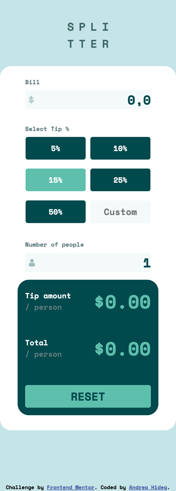
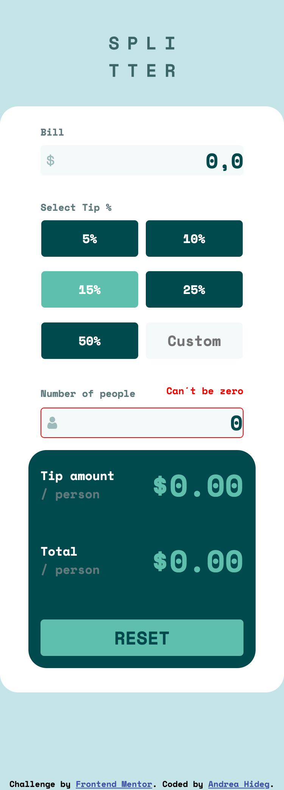
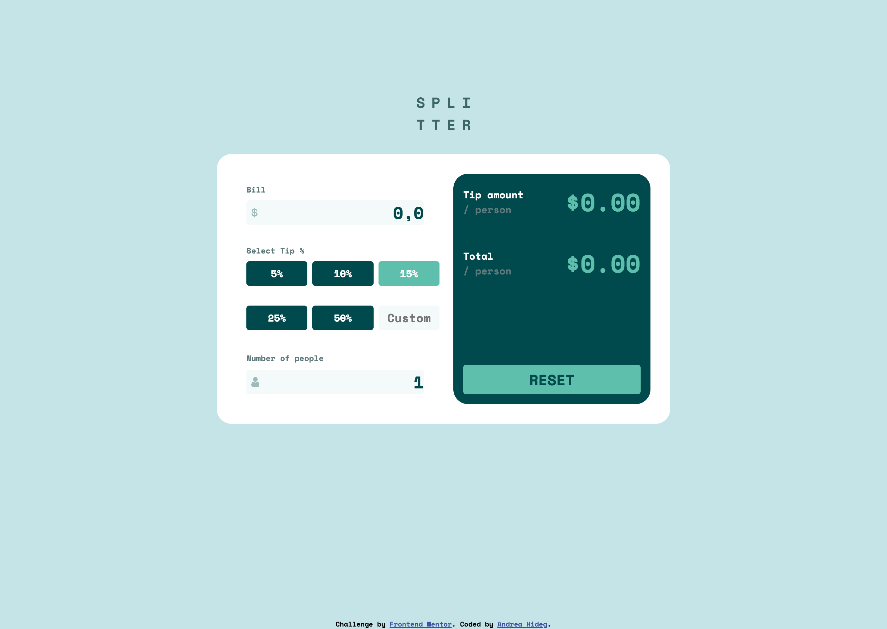
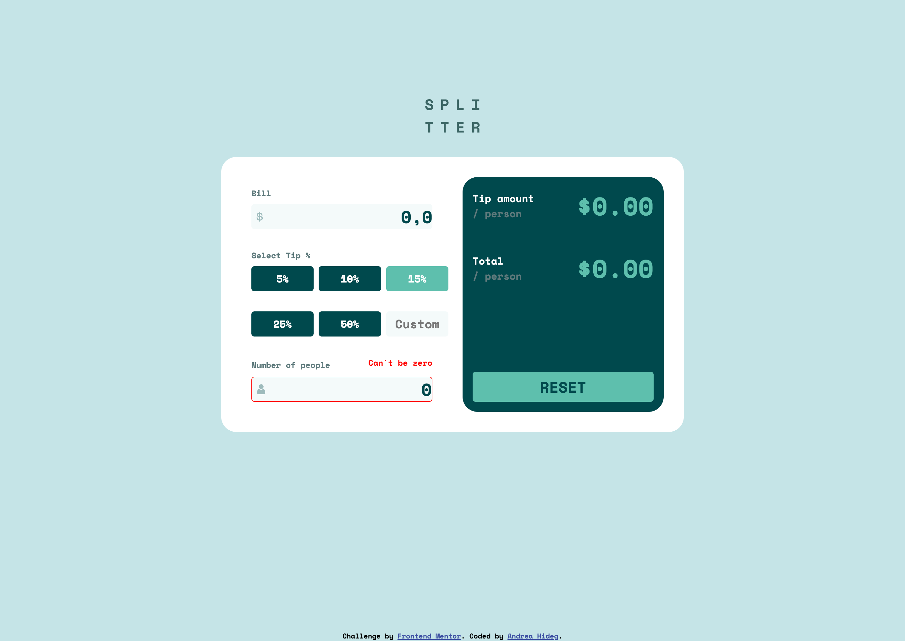

# Frontend Mentor - Tip calculator app solution

This is a solution to the [Tip calculator app challenge on Frontend Mentor](https://www.frontendmentor.io/challenges/tip-calculator-app-ugJNGbJUX). Frontend Mentor challenges help you improve your coding skills by building realistic projects.

## Table of contents

- [Overview](#overview)
  - [The challenge](#the-challenge)
  - [Screenshot](#screenshot)
  - [Links](#links)
- [My process](#my-process)
  - [Built with](#built-with)
  - [What I learned](#what-i-learned)
  - [Continued development](#continued-development)
  - [Useful resources](#useful-resources)
- [Author](#author)
- [Acknowledgments](#acknowledgments)


## Overview

### The challenge

Users should be able to:

- View the optimal layout for the app depending on their device's screen size
- See hover states for all interactive elements on the page
- Calculate the correct tip and total cost of the bill per person

### Screenshot







### Links

- Solution URL: [Add solution URL here](https://your-solution-url.com)
- Live Site URL: [Add live site URL here](https://your-live-site-url.com)

## My process

### Built with

- Semantic HTML5 markup
- CSS custom properties
- Flexbox
- Grid
- Mobile-first workflow
- JavaScript


### What I learned

- using JS parsefloat() method

- changing the button´s color on click with CSS: 

```css
button:active, button:focus {
    border: 0.5rem solid #78c6b7; /*this "moves" the button when it´s clicked on*/
    background-color: #78c6b7;
}
```

- hide the spin button, this might not works in every browser

```css
input::-webkit-outer-spin-button,
input::-webkit-inner-spin-button {
    -webkit-appearance: none;
    appearance: none;
    margin: 0;
}

```


### Continued development

- JS to add functionality to the website
- CSS responsive design 

### Useful resources

- W3Schools Js resources
- MDN JS resources
- Stackoverflow
- [Flexbox guide] (https://css-tricks.com/snippets/css/a-guide-to-flexbox/) - general help with flexbox layout

## Author

- Frontend Mentor - [@MirMurr](https://www.frontendmentor.io/profile/MirMurr)
- Live site: - [tip_calculator] (https://mirmurr.github.io/tip_calculator/)


## Acknowledgments

